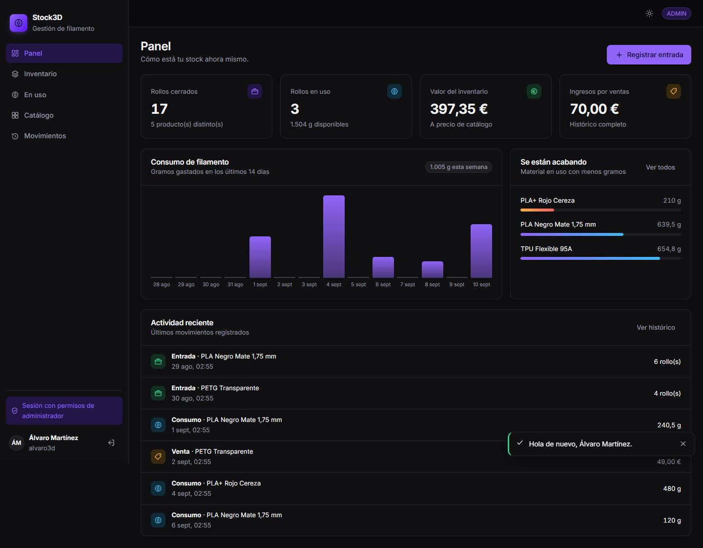
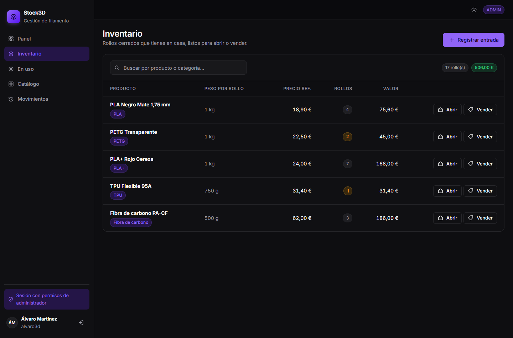
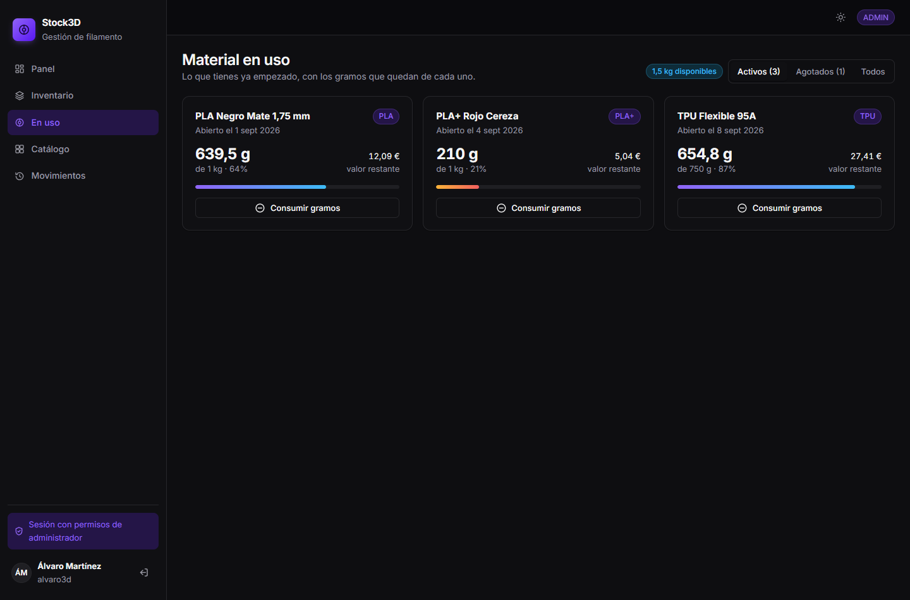
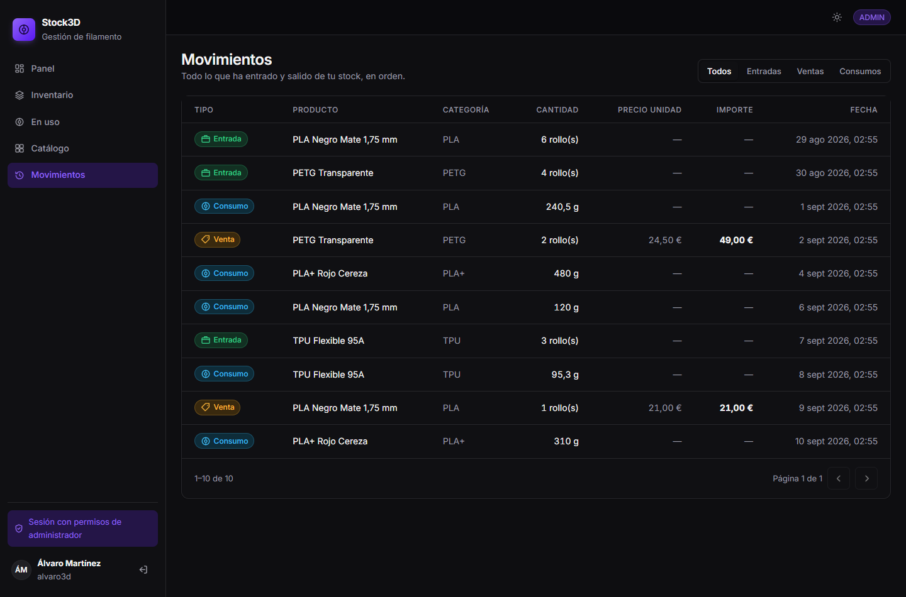
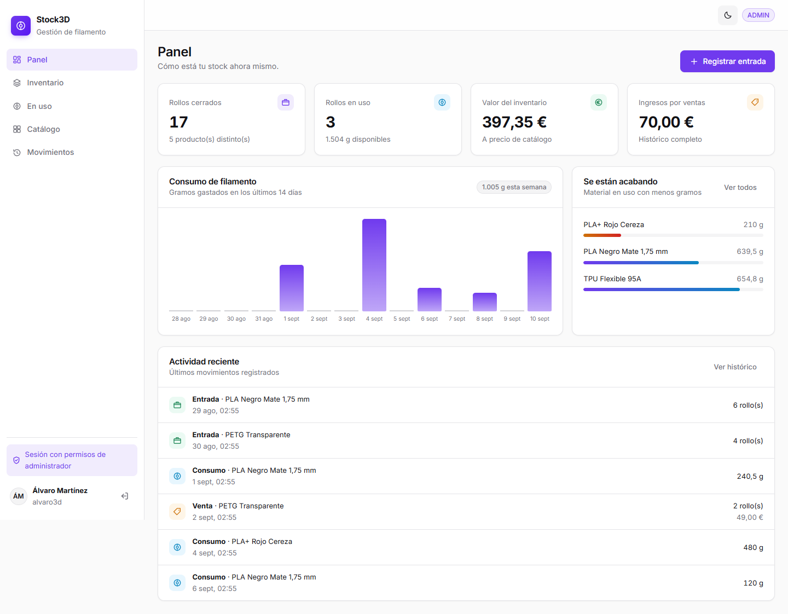
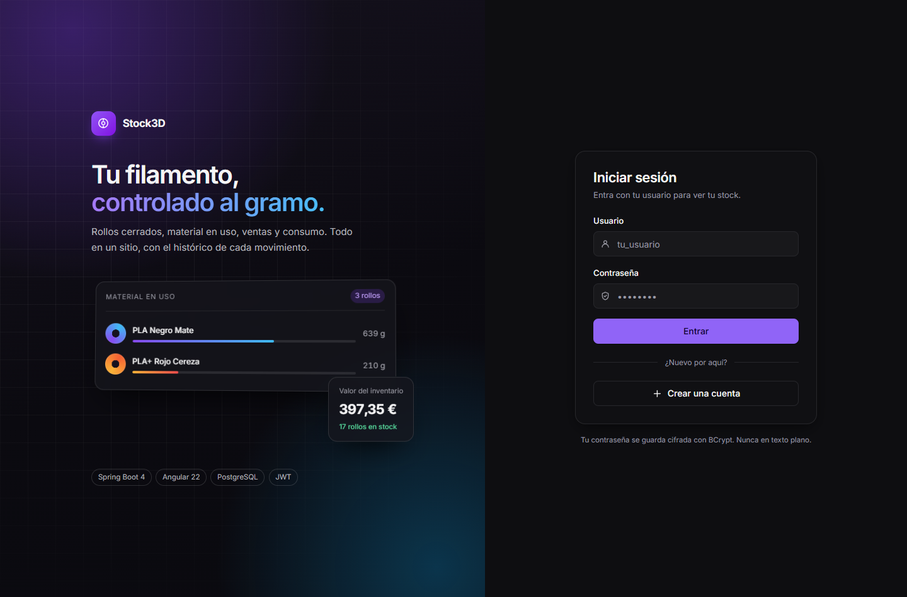
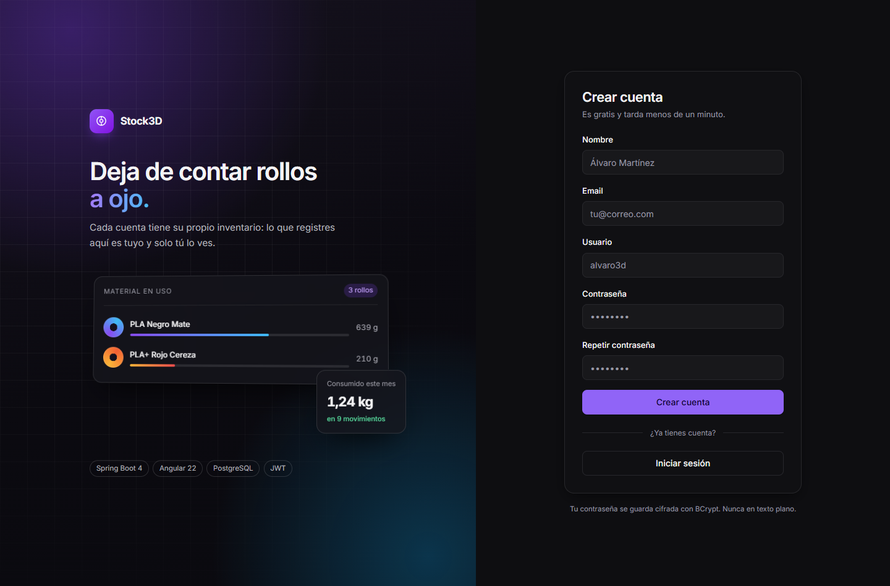
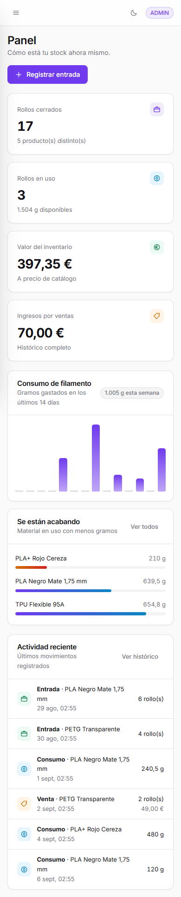

# 🧵 Stock3D — Gestión de stock de filamento 3D

Aplicación full-stack para llevar el inventario de filamento de impresión 3D: qué rollos
tienes cerrados, cuáles has abierto y cuántos gramos les quedan, qué has vendido y a qué
precio, con un histórico auditable de cada movimiento.

**Spring Boot 4 + Angular 22 + PostgreSQL**, con autenticación JWT, roles, tests y
despliegue en contenedores.



---

## 📑 Índice

- [Qué problema resuelve](#-qué-problema-resuelve)
- [Stack](#️-stack)
- [Capturas](#-capturas)
- [Funcionalidades](#-funcionalidades)
- [Arquitectura](#️-arquitectura)
- [Decisiones de diseño](#-decisiones-de-diseño)
- [Tests](#-tests)
- [Cómo ejecutarlo en local](#-cómo-ejecutarlo-en-local)
- [Despliegue](#-despliegue)
- [Estructura del repositorio](#-estructura-del-repositorio)

---

## 🎯 Qué problema resuelve

Quien imprime en 3D con cierta frecuencia acaba con un problema tonto pero real: rollos
a medias por todas partes, sin saber cuánto queda en cada uno ni cuánto material lleva
gastado. Un Excel se desincroniza a la primera.

Stock3D modela eso como lo que es, tres cosas distintas:

- Un **catálogo compartido** de productos (la ficha del filamento: precio de referencia,
  gramos por rollo, categoría).
- Un **inventario por usuario** — rollos cerrados y rollos abiertos con sus gramos
  restantes. El stock nunca es global: cada cuenta ve solo el suyo.
- Un **histórico inmutable** de movimientos: entradas, ventas y consumos, con fecha y
  autoría, que permite responder "¿cuánto vendí este mes?" o "¿qué pasó con este rollo?"
  sin recalcular nada ni fiarse de un campo que alguien olvidó actualizar.

---

## 🛠️ Stack

**Backend**
Java 25 · Spring Boot 4.1 · Spring Data JPA (Hibernate) · Spring Security + JWT (jjwt) ·
BCrypt · Bean Validation · Flyway · springdoc-openapi · Maven

**Frontend**
Angular 22 (standalone, signals, zoneless) · TypeScript · formularios reactivos ·
`HttpClient` con interceptor · guards de ruta · CSS propio con tokens de diseño, sin
librerías de UI

**Infraestructura**
PostgreSQL 16 · Docker + Docker Compose · Caddy (proxy inverso con HTTPS automático)

**Testing**
JUnit 5 · Mockito · `@SpringBootTest` + MockMvc · Vitest

---

## 📸 Capturas

| Inventario | Material en uso |
|---|---|
|  |  |

| Histórico de movimientos | Tema claro |
|---|---|
|  |  |

<details>
<summary>Ver también: acceso, alta de cuenta y versión móvil</summary>

| Iniciar sesión | Crear cuenta |
|---|---|
|  |  |

La interfaz se adapta a móvil con la barra lateral convertida en cajón:



</details>

---

## ✅ Funcionalidades

**Seguridad y cuentas**
- Registro y login con **JWT**; contraseñas cifradas con **BCrypt**, nunca en texto plano.
- **Roles** `ADMIN` / `USER`, con endpoints protegidos por rol *y* por método HTTP.
- **Protección contra IDOR**: toda operación sobre un recurso con id comprueba que ese
  recurso sea del usuario autenticado, y responde 404 (no 403) para no revelar siquiera
  que existe.
- El usuario y el rol salen siempre del token ya verificado, nunca del cuerpo de la
  petición: es imposible actuar en nombre de otra persona.

**Gestión de stock**
- Catálogo de productos con CRUD completo, restringido a `ADMIN`.
- Entradas de rollos cerrados, apertura de rollos, consumo por gramos y venta de rollos
  enteros a precio libre.
- Validaciones de negocio reales: no se puede abrir un rollo que no tienes, ni consumir
  más gramos de los que quedan, ni vender más de lo que hay.
- Panel con métricas agregadas y gráfico de consumo de los últimos 14 días.
- Histórico paginado y filtrable por tipo de movimiento.

**Calidad de la API**
- **DTOs de entrada y salida**: el cliente no puede enviar campos que no le corresponden
  (id, rol), y ninguna respuesta filtra datos sensibles — el hash de la contraseña no
  aparece en ningún JSON.
- **Paginación y filtros** con `Page`/`Pageable`.
- **Manejo global de errores** (`@RestControllerAdvice`): todo fallo, de negocio o de
  validación, sale con el mismo formato.
- **Documentación OpenAPI** navegable con Swagger UI, deshabilitada en producción.

---

## 🏗️ Arquitectura

```
                 ┌──────────────── Navegador ─────────────────┐
                 │  Angular 22 (SPA)                          │
                 │  signals · guards · interceptor JWT        │
                 └────────────────────┬───────────────────────┘
                                      │ HTTPS
                 ┌────────────────────▼───────────────────────┐
                 │  Caddy — proxy inverso + TLS automático    │
                 │   /        → estáticos de Angular          │
                 │   /api/*   → API (quitando el prefijo)     │
                 └────────────────────┬───────────────────────┘
                                      │
      ┌───────────────────────────────▼───────────────────────────────┐
      │  Spring Boot                                                  │
      │  Controller  →  Service  →  Repository                        │
      │   (HTTP)        (negocio)     (datos)                         │
      │       ▲ JwtAuthFilter + SecurityFilterChain                   │
      └───────────────────────────────┬───────────────────────────────┘
                                      │
                            ┌─────────▼─────────┐
                            │   PostgreSQL 16   │
                            │  esquema: Flyway  │
                            └───────────────────┘
```

Separación estricta de capas: el **Controller** traduce HTTP ↔ Java y no contiene reglas
de negocio; el **Service** las aplica sin saber que existe HTTP (ni un `ResponseEntity`
ahí dentro); el **Repository** solo lee y escribe.

### Modelo de dominio

```
Usuario ──┬── Inventario  (rollos cerrados)  ──┐
          │                                    │      Producto
          ├── EnUso       (rollos abiertos)  ──┼───►  catálogo compartido:
          │                                    │      precio de referencia,
          └── Movimiento  (histórico)        ──┘      gramos/rollo, categoría
```

---

## 💡 Decisiones de diseño

Las que más me han hecho pensar, y por qué:

**Estado mutable e histórico son cosas distintas.** `Inventario` y `EnUso` responden a
"cómo estoy ahora" y se modifican; `Movimiento` responde a "qué pasó" y no se edita
nunca. Mezclarlos habría hecho imposible auditar.

**Nada de datos derivados guardados "por si acaso".** No hay un booleano `agotado` en
`EnUso`: se consulta si `gramosRestantes <= 0`. Un dato duplicado es un dato que algún
día se desincroniza.

**`BigDecimal`, no `double`.** Tanto para dinero como para gramos: la coma flotante
binaria no representa 0,1 exactamente, y en un inventario eso acaba en descuadres.

**El precio de una venta no es el precio del catálogo.** El catálogo guarda una
referencia; cada movimiento de venta guarda el precio real de esa transacción concreta.

**Flyway + `ddl-auto=validate`.** El esquema se versiona en migraciones y Hibernate solo
comprueba que coincida, sin permiso para improvisar sobre la base de datos de producción.

**Abrir un rollo no genera un movimiento.** No es una entrada ni una salida: el material
sigue siendo tuyo, solo cambia de estado. Registrarlo habría ensuciado las estadísticas.

**El frontend llama a `/api`, una ruta relativa.** El mismo build vale en local y en
producción, y al ser siempre el mismo origen, CORS deja de ser un problema en lugar de
convertirse en la fuente habitual de errores.

**El frontend nunca es la barrera de seguridad.** Oculta lo que no puedes usar, pero el
backend vuelve a comprobar rol y propiedad en cada petición.

---

## 🧪 Tests

**53 tests** en el backend, entre unitarios y de integración:

```bash
cd backend && ./mvnw test
```

- **Unitarios** (JUnit + Mockito) sobre los Services: reglas de negocio aisladas, sin
  base de datos — stock negativo, consumo mayor que lo disponible, duplicados al
  registrarse.
- **Integración** (`@SpringBootTest` + MockMvc sobre H2): la cadena completa, seguridad
  incluida. Cubren que un endpoint sin token responde 403, que uno de `ADMIN` rechaza a
  un `USER`, y que **ningún listado deja ver el stock de otro usuario**.

Frontend, con Vitest: `cd frontend && npm test`.

---

## 🚀 Cómo ejecutarlo en local

**Requisitos:** JDK 21+, Node.js LTS y PostgreSQL 16 (o Docker).

<details open>
<summary><b>Opción A — Todo con Docker (un comando)</b></summary>

```bash
cp .env.example .env     # rellena las contraseñas y el JWT_SECRET
docker compose up -d --build
```

Aplicación en `http://localhost`. Levanta los tres contenedores (web, API y base de
datos) con el mismo montaje que en producción.

</details>

<details>
<summary><b>Opción B — Modo desarrollo, con recarga automática</b></summary>

```bash
# 1. PostgreSQL
docker run --name postgres-stock -e POSTGRES_PASSWORD=<password> -p 5432:5432 -d postgres:16
docker exec -it postgres-stock psql -U postgres -c "CREATE DATABASE stockdb;"

# 2. Variables de entorno del backend
export DB_USERNAME=postgres
export DB_PASSWORD=<password>
export JWT_SECRET=<cadena de 32+ caracteres>

# 3. API  →  http://localhost:8080
cd backend && ./mvnw spring-boot:run

# 4. Frontend  →  http://localhost:4200   (en otra terminal)
cd frontend && npm install && npm start
```

El servidor de desarrollo de Angular hace de proxy y reenvía `/api/*` al 8080, así que
tampoco hay peticiones entre orígenes mientras se desarrolla.

Documentación de la API: `http://localhost:8080/swagger-ui.html`.

</details>

> El primer usuario se registra desde la web y nace como `USER`. Para probar el CRUD del
> catálogo hace falta un `ADMIN`:
> `UPDATE usuario SET rol = 'ADMIN' WHERE user_name = '<tu_usuario>';` y volver a iniciar
> sesión, porque el rol viaja dentro del token.

---

## 🌐 Despliegue

`docker compose up -d --build` sobre cualquier VPS. Tres contenedores:

| Servicio | Qué hace | Expuesto |
|---|---|---|
| `web` | Caddy: sirve el Angular compilado, reparte `/api` y gestiona el certificado | 80, 443 |
| `api` | El `.jar` de Spring Boot sobre un JRE mínimo | red interna |
| `db` | PostgreSQL con volumen persistente | red interna |

Puntos a destacar del montaje:

- **La base de datos y la API no se publican a internet.** La única puerta de entrada es
  el proxy.
- **HTTPS automático**: al indicar un dominio real en `DOMINIO`, Caddy solicita y renueva
  el certificado de Let's Encrypt sin configuración adicional.
- **Imágenes multi-etapa**: se compila con el JDK y con Node, pero la imagen final solo
  lleva el JRE y los estáticos. Ni código fuente ni herramientas de build en producción.
- **La API corre como usuario sin privilegios**, no como root.
- **Cero secretos en el repositorio**: toda la configuración entra por variables de
  entorno, y `.env.example` documenta cuáles sin revelar ninguna.

---

## 📁 Estructura del repositorio

```
├── backend/                  API REST (Spring Boot)
│   ├── src/main/java/…/
│   │   ├── controller/       Endpoints HTTP
│   │   ├── service/          Lógica de negocio
│   │   ├── repository/       Acceso a datos (Spring Data JPA)
│   │   ├── model/            Entidades JPA
│   │   ├── dto/              Contratos de entrada y salida
│   │   ├── security/         JWT: filtro y utilidades
│   │   ├── config/           Spring Security, CORS
│   │   └── exception/        Manejo global de errores
│   ├── src/main/resources/db/migration/   Migraciones Flyway
│   ├── src/test/             Tests unitarios y de integración
│   └── Dockerfile
├── frontend/                 SPA (Angular)
│   ├── src/app/
│   │   ├── pages/            Una carpeta por pantalla
│   │   ├── components/       Reutilizables: diálogo, iconos, paginación
│   │   ├── services/         Llamadas a la API y estado de sesión
│   │   ├── guards/           Protección de rutas
│   │   ├── interceptors/     Inyección del JWT
│   │   ├── models/           Interfaces espejo de los DTOs
│   │   └── layout/           Barra lateral y cabecera
│   ├── Caddyfile
│   └── Dockerfile
├── capturas/
├── docker-compose.yml
└── .env.example
```

---

## 📄 Licencia

Proyecto personal, desarrollado como pieza de portfolio.
